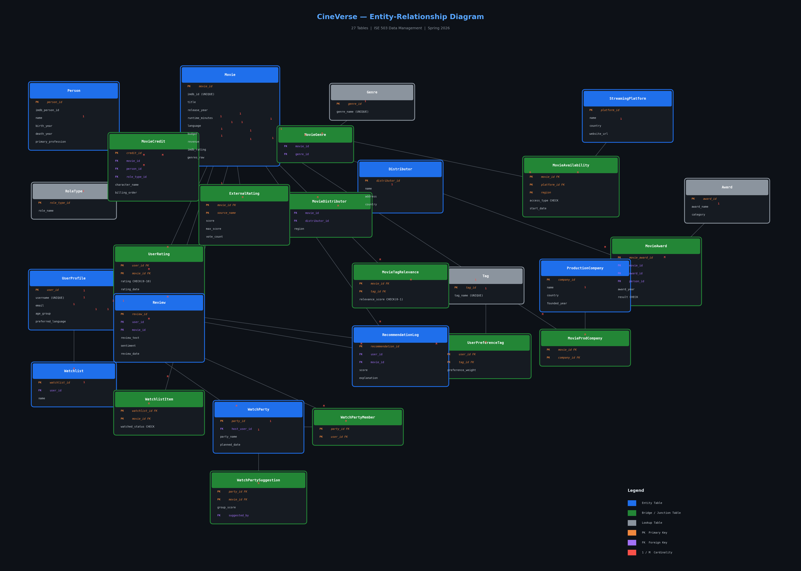
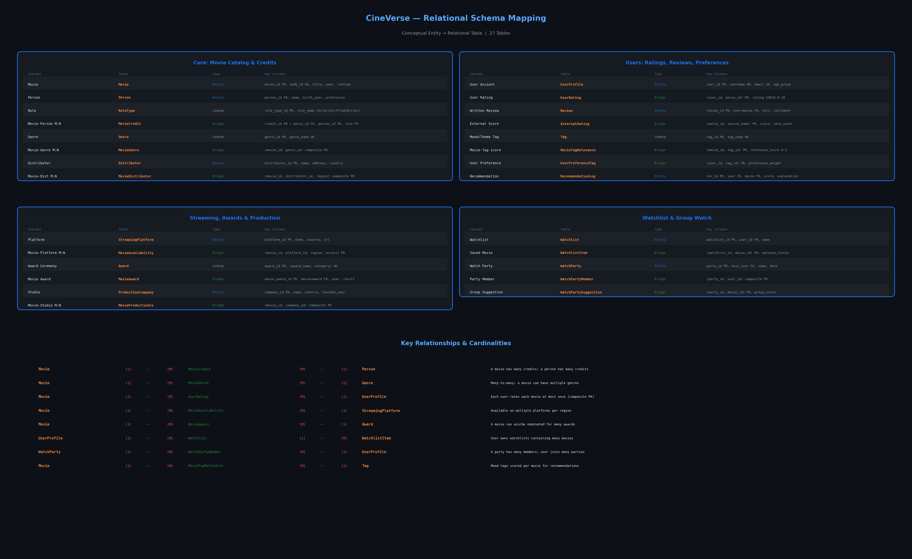
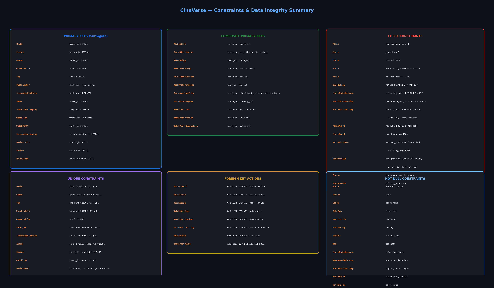

# CineVerse — Database Design Document

ISE 503: Data Management — Spring 2026

---

## 1. Conceptual Design

### 1.1 Entity Summary

| # | Entity | Description | Key Attribute |
|---|--------|-------------|---------------|
| 1 | Movie | Central movie catalog with metadata | movie_id |
| 2 | Person | Actors, directors, producers, writers | person_id |
| 3 | RoleType | Lookup for role categories (Actor, Director, Producer, Writer) | role_type_id |
| 4 | Genre | Normalized genre list (Action, Drama, etc.) | genre_id |
| 5 | Distributor | Companies that distribute films | distributor_id |
| 6 | UserProfile | Application users who rate and review movies | user_id |
| 7 | Tag | Mood/theme tags (mind-bending, dark, funny, etc.) | tag_id |
| 8 | StreamingPlatform | Netflix, Hulu, Disney+, etc. | platform_id |
| 9 | Award | Award ceremonies and categories (Oscar, Golden Globe) | award_id |
| 10 | ProductionCompany | Studios behind each film | company_id |
| 11 | Watchlist | User-created watchlists | watchlist_id |
| 12 | WatchParty | Group watch events | party_id |
| 13 | RecommendationLog | Explainable recommendation records | recommendation_id |
| 14 | Review | User-written movie reviews | review_id |

### 1.2 Relationships & Cardinalities

| Relationship | Type | Cardinality | Resolved By |
|---|---|---|---|
| Movie — Person (cast/crew) | Many-to-Many | M : N | MovieCredit (bridge table) |
| Movie — Genre | Many-to-Many | M : N | MovieGenre |
| Movie — Distributor | Many-to-Many | M : N | MovieDistributor |
| Movie — StreamingPlatform | Many-to-Many | M : N | MovieAvailability |
| Movie — Award | Many-to-Many | M : N | MovieAward |
| Movie — ProductionCompany | Many-to-Many | M : N | MovieProductionCompany |
| Movie — Tag (mood score) | Many-to-Many | M : N | MovieTagRelevance |
| User — Movie (rating) | Many-to-Many | M : N | UserRating (one rating per pair) |
| User — Movie (review) | One-to-One per pair | 1 : 1 | Review (UNIQUE user_id, movie_id) |
| User — Tag (preference) | Many-to-Many | M : N | UserPreferenceTag |
| User — Watchlist | One-to-Many | 1 : M | Watchlist.user_id FK |
| Watchlist — Movie | Many-to-Many | M : N | WatchlistItem |
| User — WatchParty (host) | One-to-Many | 1 : M | WatchParty.host_user_id FK |
| WatchParty — User (members) | Many-to-Many | M : N | WatchPartyMember |
| WatchParty — Movie (suggestions) | Many-to-Many | M : N | WatchPartySuggestion |
| User — Movie (recommendation) | One-to-Many | 1 : M | RecommendationLog |

### 1.3 ER Diagram



### 1.4 Relational Mapping



---

## 2. Constraints & Data Integrity

### 2.1 Constraint Types Used

| Constraint Type | Count | Examples |
|---|---|---|
| Primary Key (surrogate) | 15 | movie_id SERIAL, person_id SERIAL |
| Primary Key (composite) | 11 | (movie_id, genre_id), (user_id, movie_id) |
| Foreign Key | 40+ | MovieCredit.movie_id → Movie.movie_id |
| UNIQUE | 11 | Movie.imdb_id, UserProfile.username, Genre.genre_name |
| CHECK | 18 | rating BETWEEN 0 AND 10, runtime > 0, access_type IN (...) |
| NOT NULL | 20+ | title, imdb_id, username, rating, review_text |
| ON DELETE CASCADE | 8 | MovieGenre, UserRating, WatchlistItem, etc. |
| ON DELETE SET NULL | 2 | MovieAward.person_id, WatchPartySuggestion.suggested_by |
| DEFAULT | 5 | CURRENT_TIMESTAMP, CURRENT_DATE, 'English', 'unwatched' |

### 2.2 Constraints Summary Diagram



---

## 3. Relational Schema — SQL DDL

### 3.1 Core Tables

```sql
CREATE TABLE Movie (
    movie_id        SERIAL PRIMARY KEY,
    imdb_id         VARCHAR(20) UNIQUE NOT NULL,
    tmdb_id         INTEGER,
    title           VARCHAR(255) NOT NULL,
    release_year    INTEGER CHECK (release_year >= 1888),
    runtime_minutes INTEGER CHECK (runtime_minutes > 0),
    language        VARCHAR(50) DEFAULT 'English',
    country         VARCHAR(100),
    plot            TEXT,
    budget          NUMERIC(14,2) CHECK (budget >= 0),
    revenue         NUMERIC(14,2) CHECK (revenue >= 0),
    imdb_rating     NUMERIC(3,1) CHECK (imdb_rating BETWEEN 0 AND 10),
    imdb_votes      INTEGER CHECK (imdb_votes >= 0),
    poster_url      TEXT,
    genres_raw      VARCHAR(255),
    created_at      TIMESTAMP DEFAULT CURRENT_TIMESTAMP
);

CREATE TABLE Person (
    person_id          SERIAL PRIMARY KEY,
    imdb_person_id     VARCHAR(20) UNIQUE,
    name               VARCHAR(255) NOT NULL,
    birth_year         INTEGER,
    death_year         INTEGER,
    primary_profession VARCHAR(100),
    CONSTRAINT chk_person_years CHECK (death_year IS NULL OR death_year >= birth_year)
);

CREATE TABLE RoleType (
    role_type_id SERIAL PRIMARY KEY,
    role_name    VARCHAR(50) UNIQUE NOT NULL
);

CREATE TABLE MovieCredit (
    credit_id      SERIAL PRIMARY KEY,
    movie_id       INTEGER NOT NULL REFERENCES Movie(movie_id) ON DELETE CASCADE,
    person_id      INTEGER NOT NULL REFERENCES Person(person_id) ON DELETE CASCADE,
    role_type_id   INTEGER NOT NULL REFERENCES RoleType(role_type_id),
    character_name VARCHAR(255),
    billing_order  INTEGER CHECK (billing_order > 0),
    CONSTRAINT uq_movie_person_role_char UNIQUE (movie_id, person_id, role_type_id, character_name)
);
```

### 3.2 User Rating with Composite PK and CHECK

```sql
CREATE TABLE UserRating (
    user_id     INTEGER NOT NULL REFERENCES UserProfile(user_id) ON DELETE CASCADE,
    movie_id    INTEGER NOT NULL REFERENCES Movie(movie_id) ON DELETE CASCADE,
    rating      NUMERIC(3,1) NOT NULL CHECK (rating BETWEEN 0.0 AND 10.0),
    rating_date DATE DEFAULT CURRENT_DATE,
    PRIMARY KEY (user_id, movie_id)
);
```

### 3.3 Streaming Availability with 4-column Composite PK

```sql
CREATE TABLE MovieAvailability (
    movie_id    INTEGER NOT NULL REFERENCES Movie(movie_id) ON DELETE CASCADE,
    platform_id INTEGER NOT NULL REFERENCES StreamingPlatform(platform_id) ON DELETE CASCADE,
    region      VARCHAR(50) NOT NULL DEFAULT 'US',
    access_type VARCHAR(20) NOT NULL CHECK (access_type IN ('subscription','rent','buy','free','theater')),
    start_date  DATE,
    end_date    DATE,
    PRIMARY KEY (movie_id, platform_id, region, access_type)
);
```

### 3.4 Award with CHECK and SET NULL

```sql
CREATE TABLE MovieAward (
    movie_award_id SERIAL PRIMARY KEY,
    movie_id       INTEGER NOT NULL REFERENCES Movie(movie_id) ON DELETE CASCADE,
    award_id       INTEGER NOT NULL REFERENCES Award(award_id) ON DELETE CASCADE,
    person_id      INTEGER REFERENCES Person(person_id) ON DELETE SET NULL,
    award_year     INTEGER NOT NULL CHECK (award_year >= 1900),
    result         VARCHAR(20) NOT NULL CHECK (result IN ('won', 'nominated')),
    CONSTRAINT uq_movie_award_year UNIQUE (movie_id, award_id, award_year)
);
```

The full DDL for all 27 tables is in `sql/01_create_tables.sql`.

---

## 4. Data Volume

| Table | Rows | Source |
|---|---|---|
| Movie | 500 | IMDb (filtered to popular films 1970+) |
| Person | 5,166 | IMDb name.basics |
| MovieCredit | 10,021 | IMDb title.principals |
| Genre | 20 | Extracted from IMDb genres |
| MovieGenre | 1,342 | Many-to-many links |
| UserProfile | 200 | MovieLens user IDs |
| UserRating | 9,874 | MovieLens ratings (scaled 0-10) |
| Tag | 200 | MovieLens user tags |
| MovieTagRelevance | 754 | Tag frequency scores |
| ExternalRating | 500 | IMDb averageRating |
| StreamingPlatform | 10 | Netflix, Prime, Disney+, etc. |
| MovieAvailability | 995 | Synthetic per-platform assignment |
| Award | 15 | Oscar, Golden Globe, BAFTA, Cannes |
| MovieAward | 158 | Wins and nominations |
| ProductionCompany | 25 | Major studios |
| Distributor | 20 | Major distributors |
| **Total** | **31,426** | **Avg ~1,309 per table** |

---

## 5. Files Reference

| File | Purpose |
|---|---|
| `sql/01_create_tables.sql` | Complete DDL for all 27 tables |
| `sql/02_load_data.sql` | COPY commands to load from CSVs |
| `sql/02_insert_data.sql` | INSERT statements (portable alternative) |
| `sql/queries/q01-q10_*.sql` | 10 complex queries (one per file) |
| `sql/04_indexes.sql` | Performance indexes |
| `docs/database_design/er_diagram.png` | Entity-Relationship diagram |
| `docs/database_design/relational_mapping.png` | Conceptual-to-relational mapping |
| `docs/database_design/constraints_summary.png` | All constraints visualized |
